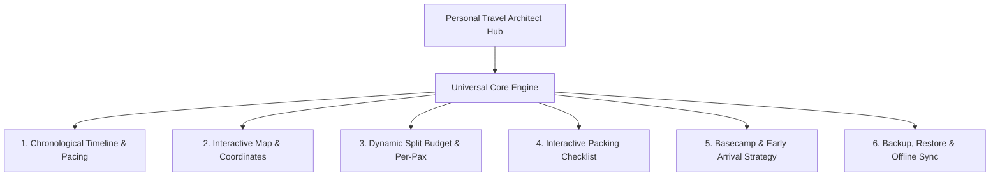
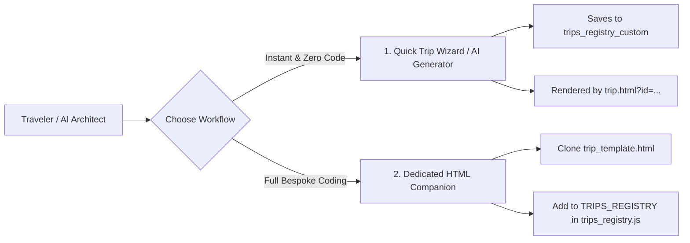

# Personal Travel Architect — Master Trip Architecture & Indispensable Features Framework

> **Authoritative Architectural Blueprint for Domestic & International Travel Systems**  
> Synthesized from production companions: *Chikmagalur Coffee & Cloud Peaks 🇮🇳* and *Vietnam Master Expedition 🇻🇳*.

---

## 1. Executive Summary & Design Philosophy

The **Personal Travel Architect** is designed around a fundamental truth:  
*Travel technology fails most when you need it most—in remote mountain hairpins, during international layovers without roaming data, or in crowded foreign markets.*

To guarantee unwavering reliability, every trip companion adheres to three architectural pillars:
1. **Zero-Build, 100% Offline PWA**: Zero dependency on Node build steps. Must run instantly from static hosting (Vercel, Netlify, GitHub Pages) or even directly as a local `file://`. Service Workers cache all fonts, icons, maps, and logic.
2. **Dual-Tier Journey Topology**: Clean separation between **Domestic Expeditions** (first-mile/last-mile buses, express trains, self-drive routes, ghat hairpin logistics) and **International Passports** (multi-origin connecting flights, visa gatekeepers, foreign currency forex, and linguistic dining cards).
3. **100% Client-Side Customizability**: Every trip must be editable in-browser via intuitive modals with real-time `localStorage` persistence and 1-click JSON backup/restore.

---

## 2. The Universal Core Matrix (Required for EVERY Trip)

Every trip created on the platform—whether a 3-day weekend hill escape or a 14-day global expedition—**MUST** include the following 6 core modules:



### 1. Chronological Timeline & Pacing
- **Visual Schedule**: Color-coded morning, afternoon, evening, and night event cards.
- **Transit Synchronization**: Day 1 automatically embeds the Outbound/Arrival transit card; the final day embeds the Return transit card.
- **Pacing Control**: Senior Comfort / Relaxed mode toggle to highlight gentle walking trails and flag steep stairs.

### 2. Interactive Map & Navigation
- **Offline Coordinates**: Leaflet/OSM interactive canvas preloaded with lat/long for stays, sights, and food spots.
- **1-Tap Navigation**: Direct `https://www.google.com/maps/dir/?api=1&destination=...` links for one-touch navigation in phone navigation apps.

### 3. Dynamic Split Budget & Expense Engine
- **Pre-filled Realistic Allocations**: Stays, transit, sightseeing/rentals, meals, and emergency buffer.
- **Dynamic Per-Pax Splitter**: Real-time slider/selector (e.g. 2, 3, 4, 5+ travelers) that recalculates per-person liability instantly without altering the total group cost.
- **Custom Expense Ingestion**: Modal to log on-the-go expenses with date, category, notes, and local currency amounts.

### 4. Interactive Packing & Readiness Checklist
- **Categorized Verification**: Documents, Electronics, Mountain/Rain Gear, Medical First Aid, Toiletries.
- **Real-Time Progress**: Dynamic percentage bar with count indicators (`X% (Y/Z items)`).
- **Custom Item Ingestion**: In-browser capability to add/delete personal items and persist state.

### 5. Basecamp & Early Arrival Protocol
- **Luggage Strategy**: Clear instructions for early arrivals (e.g. 6:30 AM arrival before 12:00 PM check-in: 24-hr cloakroom bag drop, freshen up in lobby, head out luggage-free).
- **Amenities & Surroundings**: Nearby walking-distance dining, local markets, and emergency medical stores.

### 6. Universal JSON Backup & Synchronization
- **Zero Lock-in**: 1-click JSON Export of all customizations.
- **Cross-Device Sync**: Ability to import JSON on a co-traveler\x27s phone or desktop to instantly replicate all modified PNRs, routes, and custom budget items.

---

## 3. Domestic Trip Architecture (Western Ghats & National Escapes)

*Distilled from the Chikmagalur Coffee & Cloud Peaks implementation.*

| Indispensable Feature | Why It Cannot Be Missed | Implementation in Architect Hub |
| :--- | :--- | :--- |
| **Going & Return Transit Matrix** | Domestic trips rely heavily on first/last-mile overnight buses, express trains, or self-drive highways. Travelers lose bookings if PNRs/berths are buried. | Dedicated Outbound & Return cards with mode switchers (`[Bus]`, `[Train]`, `[Car]`, `[Cab]`), boarding/drop points, timings, PNR copy button, and seats. |
| **In-Trip Hybrid Mobility Hub** | Mountain terrain requires different vehicles for different days (e.g., steep hairpins require 4x4 jeeps; scenic valley loops favor 125cc scooties). | Clear breakdown of Day 1 private sightseeing cab + 4x4 jeep vs Day 2–3 125cc scooty rentals with fuel stations, rental rules, and deposit tracking. |
| **Driver Translation / Auto Card** | In regional destinations, auto drivers and local transport operators may not speak English/Hindi. | One-tap native script cards (e.g. Kannada destination cards for Chikmagalur) with phonetic pronunciation and landmarks. |
| **Highway Dining & Pitstops** | Highway travel (e.g. NH 75 Bengaluru–Hassan) requires strategic, clean vegetarian dining stops. | Curated highway stop recommendations (e.g. Paakashala Yediyur) embedded into travel notes. |
| **Weather & Mountain Mist Advisory** | Hill stations feature rapid weather changes, morning mist, and altitude variations (1,000m – 1,930m). | Live weather badges, clothing recommendations (windbreakers, rain layers), and road condition alerts. |

---

## 4. International Trip Architecture (Global & Multi-City Passports)

*Distilled from the Vietnam Master Expedition implementation.*

| Indispensable Feature | Why It Cannot Be Missed | Implementation in Architect Hub |
| :--- | :--- | :--- |
| **Multi-Leg Connecting Flight Matrix** | Modern international groups often originate from different cities (e.g. Delhi parents & Bengaluru adults) and meet at a foreign hub (e.g. Bangkok/Hanoi). | Segmented route cards displaying Leg 1 + Leg 2, layover duration risk gauges (e.g. 2h 45m safe vs 1h 45m tight), baggage recheck alerts, and multi-leg editors. |
| **Multi-Currency & Forex Live Switcher** | Foreign exchange creates confusion when evaluating dining and taxi prices. | Instant currency converter (VND/USD/EUR ➔ INR) + "Rule of Thumb" mental math cards (e.g., *100,000 VND ≈ ₹330 INR*). |
| **Dietary Language Survival Cards** | Strict vegetarians, Jains, and allergic travelers face severe cross-contamination risks abroad. | Visual audio cards in local script (e.g., *"Tôi ăn chay — Không nước mắm, không thịt"* in Vietnamese) + curated pure-veg restaurant guide. |
| **Immigration & Visa Gatekeeper** | Missing visa printouts or insufficient passport validity (under 6 months) leads to denied boarding. | E-visa checklist, passport expiry warnings, departure fee guidelines, and consular emergency hotline cards. |
| **Cross-City VIP Logistics Hub** | Multi-destination trips require pre-booked luxury limousines, sleeper trains, and overnight cruise transfers. | Dedicated logistics schedule with driver contact cards, pier embarkation times, and domestic flight connections. |

---

## 5. Adding New Trips: Two Seamless Pathways

The platform provides two streamlined methods to scaffold and launch new trips:



### Pathway A: Universal Quick Trip Wizard (Instant, Zero Coding)
1. On `index.html`, click **"New Trip Wizard"** or **"Add Trip"**.
2. Select **Domestic Expedition 🇮🇳** or **International Passport 🌐**.
3. Fill in Title, Destination, Dates, Group Size, and Primary Transit.
4. Click **Launch New Trip**:
   - Automatically generates structured JSON in `localStorage`.
   - Adds entry to `trips_registry_custom`.
   - Immediately renders and launches the interactive companion via `trip.html?id=...`.

### Pathway B: Dedicated Standalone Companion (Full Customization)
1. Copy `trip_template.html` (or `chikmagalur_trip_architect.html` for domestic / `vietnam_trip_architect_5_0.html` for international).
2. Save as `[destination]_trip_architect.html`.
3. Register the new file in `TRIPS_REGISTRY` inside `trips_registry.js`.
4. Deploy to Vercel/Netlify—it immediately appears in the Hub with category badges and filters.

---

## 6. Standardized Trip JSON Schema Reference

Every trip object in the system conforms to the following schema contract:

```json
{
  "id": "destination-year",
  "title": "Descriptive Trip Title",
  "destination": "City, State/Country",
  "flag": "🇮🇳 or 🌐",
  "status": "upcoming | past",
  "category": "domestic | international",
  "dates": "Mon DD – Mon DD, YYYY",
  "startDate": "YYYY-MM-DD",
  "endDate": "YYYY-MM-DD",
  "daysCount": 3,
  "travelers": "2–3 Travelers",
  "heroGradient": "from-emerald-950 via-teal-900 to-slate-950",
  "badge": "Upcoming • Region Name",
  "accentColor": "#10b981",
  "url": "destination_trip_architect.html or trip.html?id=...",
  "summary": "1-2 sentence executive architectural summary.",
  "basecamp": "Hotel Name (Address & distance from transit hub)",
  "transport": "Primary mobility summary",
  "transitMode": "Overnight Sleeper Bus | Connecting Flights | Express Train",
  "features": [
    { "icon": "fa-route", "label": "Going & Return Transit Matrix" },
    { "icon": "fa-calculator", "label": "Custom Split Budget" },
    { "icon": "fa-map-location-dot", "label": "Offline Maps & Route" },
    { "icon": "fa-clipboard-check", "label": "Interactive Packing List" }
  ],
  "highlights": [
    { "icon": "fa-mountain", "title": "Top Attraction", "desc": "Contextual tip" }
  ],
  "quickItinerary": [
    { "day": "Day 1", "title": "Arrival, Bag Drop & Initial Exploration" }
  ]
}
```

---

## 7. Operational Checklist for Future AI Agents & Maintainers

When adding or upgrading any trip companion:
1. **Verify Domestic vs. International Tagging**: Always assign `category: "domestic"` or `category: "international"`.
2. **Never Miss the First/Last-Mile Transit**: Confirm outbound and return logistics with operator, PNR/booking ref, and boarding times.
3. **Verify Mobile Viewport Compatibility**: Ensure touch targets are at least 44px, sticky bottoms do not overlap system home indicators, and backdrop blur is hardware-accelerated.
4. **Preserve Single-Page Offline Capability**: Do not introduce npm build tools that break static serving.
5. **Run Syntax Validation**: Always run Node.js compilation and mock DOM checks on `index.html` and companions before committing.
